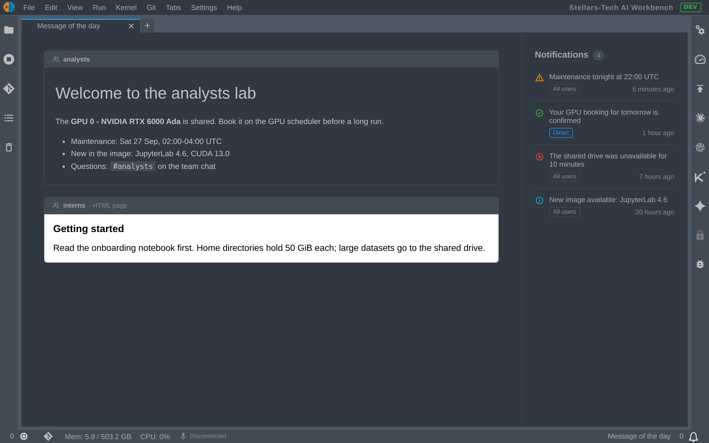

# jupyterlab_galaxahub_motd_extension

[](https://github.com/stellarshenson/jupyterlab_galaxahub_motd_extension/actions/workflows/build.yml)
[](https://www.npmjs.com/package/jupyterlab_galaxahub_motd_extension)
[](https://pypi.org/project/jupyterlab-galaxahub-motd-extension/)
[](https://pepy.tech/project/jupyterlab-galaxahub-motd-extension)
[](https://jupyterlab.readthedocs.io/en/stable/)
[](https://kolomolo.com)
[](https://www.paypal.com/donate/?hosted_button_id=B4KPBJDLLXTSA)

Shows the GalaxaHub message of the day in a JupyterLab tab. When the lab starts, the extension pulls
the welcome content that the user's groups carry and the broadcasts sent to the user. It opens a
**Message of the day** tab with the hub's entries, or with the local or built-in page when the hub
has none.



## Features

- **Welcome tab on start** - opens the Message of the day tab and makes it current when the hub
  carries at least one welcome entry for the user; notifications alone never open it. The tab
  has a bold label and no icon
- **Once per server start** - the tab opens by itself on the first load of the lab after each lab
  server start; a later load, a browser refresh included, opens no tab, and the palette command
  opens it at any time
- **Local page** - when the hub gives no welcome entry for the user (a hub URL setting empty, no
  motd extension, not reachable, an error, or no entry), the tab shows the local HTML page the lab
  config names, or, while none is named, the extension's built-in page with its version, what it
  does, its settings and the hub API it reads
- **Silent without a page** - with `fallback_html` naming a file that does not exist, those cases
  open nothing and log one console line
- **Two columns** - the entry cards on the left in 3/4 of the width, the Notifications column in
  the other 1/4; a tab narrower than 800 px stacks them. A lab whose config names no notifications
  URL has no Notifications column, and its cards take the full width of the tab. The room of the
  scrollbar beside the cards is kept while they do not scroll, so a card keeps its width
- **One card per group** - markdown rendered by the lab's own markdown renderer, an HTML package
  shown in a sandboxed iframe at its hub address, sized to fit its page; the entry's `label` heads
  the card, and an entry with no label has no header bar. In a markdown entry a link to a heading
  of the same entry (`[text](#Getting-started)` or the GitHub form `#getting-started`) scrolls
  to that heading
- **Scripts in HTML pages** - the JavaScript of an HTML page runs in the tab, in a hub page and in
  the local page; `c.GalaxaHubMotd.html_allow_scripts = False` in the lab's Jupyter config stops
  it
- **Notifications catch-up** - the broadcasts of the last 24 hours, 3 days or 7 days (a setting)
  sent to all users and those naming the user, newest first, each a card tinted in its type's
  colour, with the type's icon, the relative time and an all or direct marker
- **Palette command** - `Message of the day: Open` pulls again and reopens the one tab; the tab
  closes, and the command opens nothing, only when `fallback_html` names a file that does not exist
- **Token stays on the server** - a server extension calls the hub with the lab's API token and
  passes Etags through, so the browser never holds the token and a repeated pull answers 304

## Requirements

- JupyterLab >= 4.6
- A GalaxaHub hub carrying `galaxahub-motd-extension`; without it the tab shows only the local or
  built-in page
- The two hub URLs in the lab's Jupyter config, as [Server configuration](#server-configuration)
  states; without them the tab shows only the local or built-in page

## Install

```bash
pip install jupyterlab_galaxahub_motd_extension
```

## Settings

| Setting              | Default | Effect                                                                               |
| -------------------- | ------- | ------------------------------------------------------------------------------------ |
| `openOnStart`        | `true`  | open the tab once per lab server start; `c.GalaxaHubMotd.open_on_start` must be on   |
| `reopenOnBroadcast`  | `false` | reopen the tab when a live broadcast arrives through the notifications extension     |
| `pollMinutes`        | `0`     | pull again on this interval while the tab is open; `0` never polls                   |
| `notificationWindow` | `24h`   | how far back Notifications lists broadcasts: `24h`, `3d` or `7d`; the CLI follows it |

## Server configuration

The lab's Jupyter config names the two hub URLs the extension reads, and optionally a local page,
the tab label, whether the tab opens on lab start and whether the scripts of an HTML page run. The
two URLs are empty by default, and while either one is empty the extension asks no hub and shows
only the local or built-in page.

| Setting                                 | Value                                                                                                                                                     |
| --------------------------------------- | --------------------------------------------------------------------------------------------------------------------------------------------------------- |
| `c.GalaxaHubMotd.motd_api_url`          | base URL of the motd API; the extension reads `<url>/rich` and `<url>/terminal`                                                                           |
| `c.GalaxaHubMotd.notifications_api_url` | URL that answers the broadcasts sent to the user; while it is empty the tab has no Notifications column, and its cards take the full width                |
| `c.GalaxaHubMotd.fallback_html`         | absolute path of a local HTML page, shown when the hub gives no welcome entry; the files in its folder are served too; empty (default): the built-in page |
| `c.GalaxaHubMotd.label`                 | label of the tab and of the local page's card; default `Message of the day`                                                                               |
| `c.GalaxaHubMotd.open_on_start`         | `True` (default): the tab opens on the first load after each lab server start; `False`: no load opens the tab, whatever each user's `openOnStart`         |
| `c.GalaxaHubMotd.html_allow_scripts`    | `True` (default): the JavaScript of an HTML page runs, in a hub page and in the local page; `False`: no script in a page runs                             |

- **Files** - `jupyter_server_config.py` or `jupyter_lab_config.py` (or their `.json` form) in a
  Jupyter config directory; `jupyter --paths` lists the directories
- **Not read** - the `jupyter_server_config.d/` directories, which carry only extension enabling
- **CLI** - `jupyterlab-galaxahub-motd` asks the running lab server for both values, so a `--config`
  file on the lab's command line applies to it too
- **Token** - the extension sends the lab's `JUPYTERHUB_API_TOKEN` to both URLs, so both must
  belong to the hub that spawned the lab
- **Local page** - shown in the same sandboxed frame as a hub HTML page; a path that names no
  file shows no page, and the server log names it
- **Scripts** - `html_allow_scripts` is a lab config setting only, with no entry in the lab's
  Settings Editor. A page on the lab's origin is read with the user's login, so its script has the
  access of the lab page itself: it can call the lab server as the user. Keep the setting on only
  where an administrator alone can write the pages. The frame's sandbox still blocks form
  submission, `alert`, `confirm` and `prompt`, downloads and navigation of the lab page, without
  a visible message
- **Page height** - the tab sets the frame's height to the page's height, so a page whose script
  sets its height from the window height (`window.innerHeight` in a resize handler) makes its
  card grow for as long as the tab is visible; such a page must take its height from its content
- **Hub header** - a hub can forbid script in its pages with its own `Content-Security-Policy`
  header (`script-src 'none'`); the browser then runs no script in them, whatever this setting
  says

For a GalaxaHub lab, where `JUPYTERHUB_API_URL` is the hub API of the lab:

```python
import os

hub = os.environ.get("JUPYTERHUB_API_URL", "")
if hub:
    c.GalaxaHubMotd.motd_api_url = f"{hub}/extensions/motd"
    c.GalaxaHubMotd.notifications_api_url = f"{hub}/user-notifications"
c.GalaxaHubMotd.fallback_html = "/opt/motd/index.html"  # optional; empty shows the built-in page
c.GalaxaHubMotd.label = "Message of the day"            # optional
c.GalaxaHubMotd.open_on_start = True                    # optional; once per lab server start
c.GalaxaHubMotd.html_allow_scripts = True               # optional; False runs no script in a page
```

## Server routes

The server extension proxies three hub reads under its own prefix and adds nothing to them. It
reads the two URLs from [Server configuration](#server-configuration) and `JUPYTERHUB_API_TOKEN`
from the lab's environment.

| Route                                                    | Hub URL                       |
| -------------------------------------------------------- | ----------------------------- |
| `GET /jupyterlab-galaxahub-motd-extension/terminal`      | `GET <motd_api_url>/terminal` |
| `GET /jupyterlab-galaxahub-motd-extension/rich`          | `GET <motd_api_url>/rich`     |
| `GET /jupyterlab-galaxahub-motd-extension/notifications` | `GET <notifications_api_url>` |

- The hub's status, body, `Content-Type`, `Etag` and `Cache-Control` pass through, and the
  browser's `If-None-Match` goes to the hub; a matching Etag answers 304 with no body
- **One answer for an absent hub** - a hub 404 (no motd extension), a hub that cannot be reached,
  and an empty URL setting all answer `204 No Content` with `Cache-Control: no-cache` on the
  terminal and notifications routes; the server log states which of the three it was
- Any other hub status, 403 included, passes through unchanged on those two routes
- **Local page** - the rich route answers the local page as the one HTML entry whenever the hub
  gives no entry: every case above, and a 200 with no entry.
  `GET /jupyterlab-galaxahub-motd-extension/local/<path>` serves the page `fallback_html` names and
  the files in its folder; `GET /jupyterlab-galaxahub-motd-extension/about/index.html` serves the
  built-in page with the installed version. Both answer a logged-in user only
- **Settings** - `GET /jupyterlab-galaxahub-motd-extension/settings` answers `motd_api_url` and
  `notifications_api_url` as the running server holds them; the CLI reads it
- **Hub side** - [docs/design-api.md](docs/design-api.md) states what a hub must answer on the
  three routes, for a developer who writes the hub side without GalaxaHub

## Motd schema

A hub gives the motd through three GET routes at the two URLs of
[Server configuration](#server-configuration). The extension sends
`Authorization: token <JUPYTERHUB_API_TOKEN>`, and the hub answers with the data of the user who
owns that token. A hub that answers as this section states works with the extension;
[docs/design-api.md](docs/design-api.md) holds the full contract.

| Route                     | Answer                                | Read by  |
| ------------------------- | ------------------------------------- | -------- |
| `<motd_api_url>/rich`     | JSON, the user's welcome entries      | tab, CLI |
| `<notifications_api_url>` | JSON, the broadcasts sent to the user | tab, CLI |
| `<motd_api_url>/terminal` | plain text, the user's terminal text  | CLI only |

### Welcome entries

```json
{
  "entries": [
    {
      "label": "Interns",
      "kind": "markdown",
      "body": "# Welcome\n\nRead the handbook first."
    },
    {
      "label": "Research",
      "kind": "html",
      "url": "/hub/api/extensions/motd/rich/<package-id>/index.html"
    }
  ]
}
```

| Field   | Type                     | Required              | Meaning                                                                                          |
| ------- | ------------------------ | --------------------- | ------------------------------------------------------------------------------------------------ |
| `label` | string                   | no                    | heading of the entry's card; missing or blank: the card has no header bar                        |
| `kind`  | `"markdown"` or `"html"` | yes                   | how the entry is shown; an entry of another kind is dropped                                      |
| `body`  | string                   | with `kind: markdown` | markdown text, shown by the lab's markdown renderer, which removes scripts and unsafe HTML       |
| `url`   | string                   | with `kind: html`     | address of an HTML page, shown in a frame; a path from the host root is read on the lab's origin |

- **Order** - the tab shows one card per entry, in answer order
- **No entry** - `{"entries": []}` means the user has no welcome entry, and the tab shows the local
  or built-in page
- **HTML page** - the page must allow the lab to frame it (`frame-ancestors 'self'` when hub and
  lab share one origin); its scripts run as `c.GalaxaHubMotd.html_allow_scripts` and the hub's
  own `Content-Security-Policy` allow

### Broadcasts

```json
{
  "notifications": [
    {
      "ts": "2026-09-29T08:00:00+00:00",
      "message": "Maintenance tonight at 22:00",
      "type": "warning",
      "audience": "all"
    }
  ]
}
```

| Field      | Type   | Required | Meaning                                                                                              |
| ---------- | ------ | -------- | ---------------------------------------------------------------------------------------------------- |
| `message`  | string | yes      | the text of the broadcast; a row without it is dropped                                               |
| `ts`       | string | yes      | ISO 8601 time the broadcast was sent; a row whose time cannot be read is not listed                  |
| `type`     | string | no       | `info`, `success`, `warning`, `error` or `in-progress`; any other value is shown as the default type |
| `audience` | string | no       | `direct` for a broadcast that named the user; any other value is shown as All users                  |

### Terminal text

`GET <motd_api_url>/terminal` answers `text/plain; charset=utf-8`, which the CLI prints as
received, and `204` when the user has no terminal text.

### Status codes

| Hub status                                | What the extension does                                                                                                                                |
| ----------------------------------------- | ------------------------------------------------------------------------------------------------------------------------------------------------------ |
| 200                                       | uses the body as the current rows                                                                                                                      |
| 304                                       | keeps the rows it holds                                                                                                                                |
| 404                                       | treats the hub as having no motd                                                                                                                       |
| no connection, timeout, empty URL setting | same as 404                                                                                                                                            |
| any other status, including 403 and 500   | broadcasts: marks the pull as failed and keeps the rows it holds; welcome entries: shows the local or built-in page, as for every answer with no entry |

The hub sends `Cache-Control: no-cache` on every answer, a 204 included, because a browser caches
a 204 by default.

## Command line

The package installs `jupyterlab-galaxahub-motd`, which prints what the hub holds for the user in a
lab terminal; it does not print the local or built-in page. It asks the running lab server for the two URLs, so whatever configured the lab
applies, and makes the three hub reads itself with `JUPYTERHUB_API_TOKEN`. It finds the lab server
through `JUPYTER_SERVER_URL`, which JupyterLab sets in every terminal.

```bash
jupyterlab-galaxahub-motd show                   # terminal text, rich entries, notifications
jupyterlab-galaxahub-motd notifications --json   # one JSON document
jupyterlab-galaxahub-motd terminal 2>/dev/null   # in a lab startup script
```

A lab startup script prints the motd with the last line and holds no motd URL and no token. With
no motd, or a hub that fails, stdout stays empty.

`jupyterlab-galaxahub-motd --help` lists the commands, the configuration, the environment
variables and the exit codes, and each command's `--help` carries examples.

The repository carries an agent skill,
[`.agents/skills/jupyterlab-galaxahub-motd-extension/SKILL.md`](.agents/skills/jupyterlab-galaxahub-motd-extension/SKILL.md).
`pip install` puts a copy in `share/jupyter/agents/skills/` under the Python environment. No agent
reads that directory, so a lab image links it into the agent skills directory, with the Python that
runs the lab:

```bash
mkdir -p ~/.agents/skills
ln -s "$(python -c 'import sys; print(sys.prefix)')/share/jupyter/agents/skills/jupyterlab-galaxahub-motd-extension" ~/.agents/skills/jupyterlab-galaxahub-motd-extension
```

Agents that read `.agents/skills` also find it in a clone of this repository; to make it available
to Claude Code everywhere, link it into the skills directory from the clone:

```bash
ln -s "$PWD/.agents/skills/jupyterlab-galaxahub-motd-extension" ~/.claude/skills/jupyterlab-galaxahub-motd-extension
```

## Uninstall

```bash
pip uninstall jupyterlab_galaxahub_motd_extension
```
